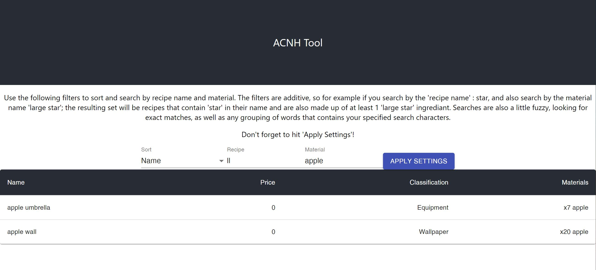

# Animal Crossing New Horizons Tool

# Demo
 [Live Demo Here](https://aml2732.github.io/acnh-tool/)

# Development:
- `cd acnh-tool`
- `npm start`

# Data Generation:
If you need to regenerate the data follow the instructions below:
- To generate data you must go to the Fan maintained source: https://tinyurl.com/acnh-sheet
- In google doc, click the 'Recipes' tab (You might have to arrow over for a bit to find it)
- Then in google doc go to file>download>.csv
- Save/move that file into acnh-tool/data with the file name `Recipes.csv`
- Do the above steps again for the other tabs and name them:
  - Fencing tab: `/data/Fencing.csv`
  - Floors tab: `/data/Floors.csv`
  - Housewares tab: `/data/Housewares.csv`
  - Miscellaneous tab: `/data/Miscellaneous.csv`
  - Rugs tab: `/data/Rugs.csv`
  - Tools tab: `/data/Tools.csv`
  - Wall-mounted tab: `/data/Wall-mounted.csv`
  - Wallpaper tab: `/data/Wallpaper.csv`
- Then run this script: `node scripts/generate-data.js`
- ~~The data will output to acnh-tool/data.json~~ DONE
- ~~Copy this javascript array into recipeList.js~~ DONE

Note this isn't automatically included in the project cus copying all that data and putting on my github in its raw form just doesn't seem right.

# Create dist
- `npm run build`
- Note: you can see your built output in `build` folder, but for demo purposes, a copy is placed in `demo`.
- Note Note: Copying and pasting isn't enough for ^ above step. You need to replace `/static/` with `./static` in index.html (`npm run build` builds with you having a static server in mind. You need to change it to run localy to use relative paths)

# Creation notes:
This project was bootstrapped with [Create React App](https://github.com/facebook/create-react-app).
And uses : Nodejs, [Material UI](https://material-ui.com/) and the resources found [here](https://tinyurl.com/acnh-sheet).
